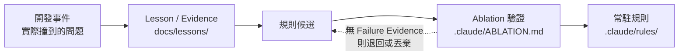
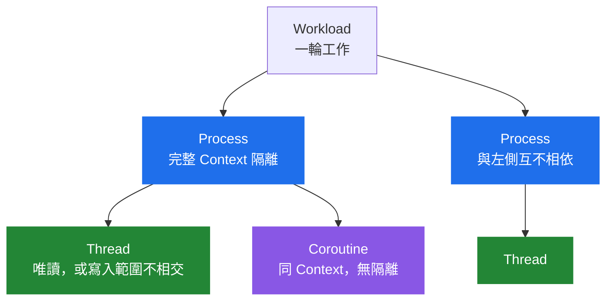
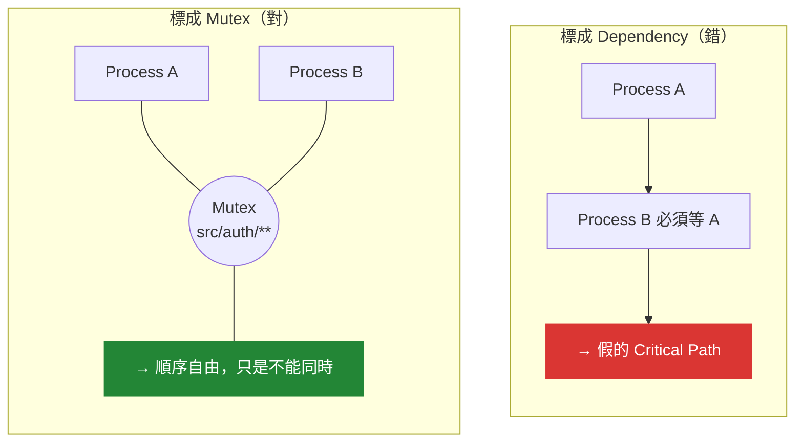
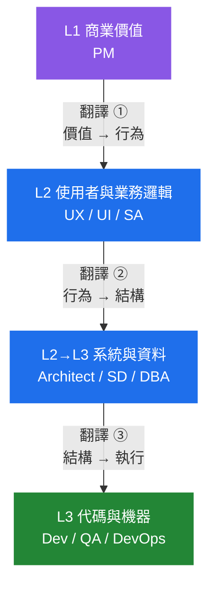
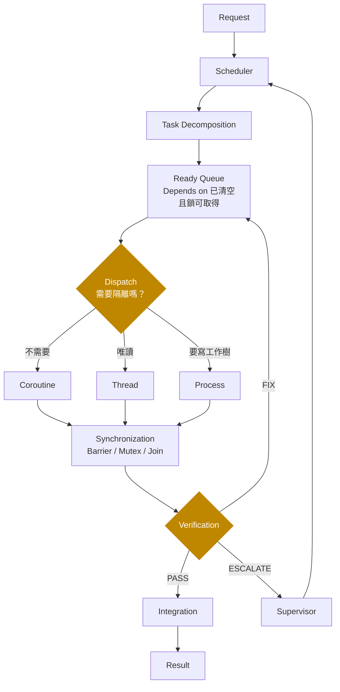
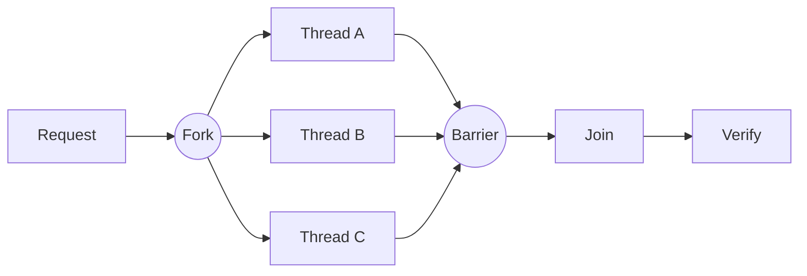
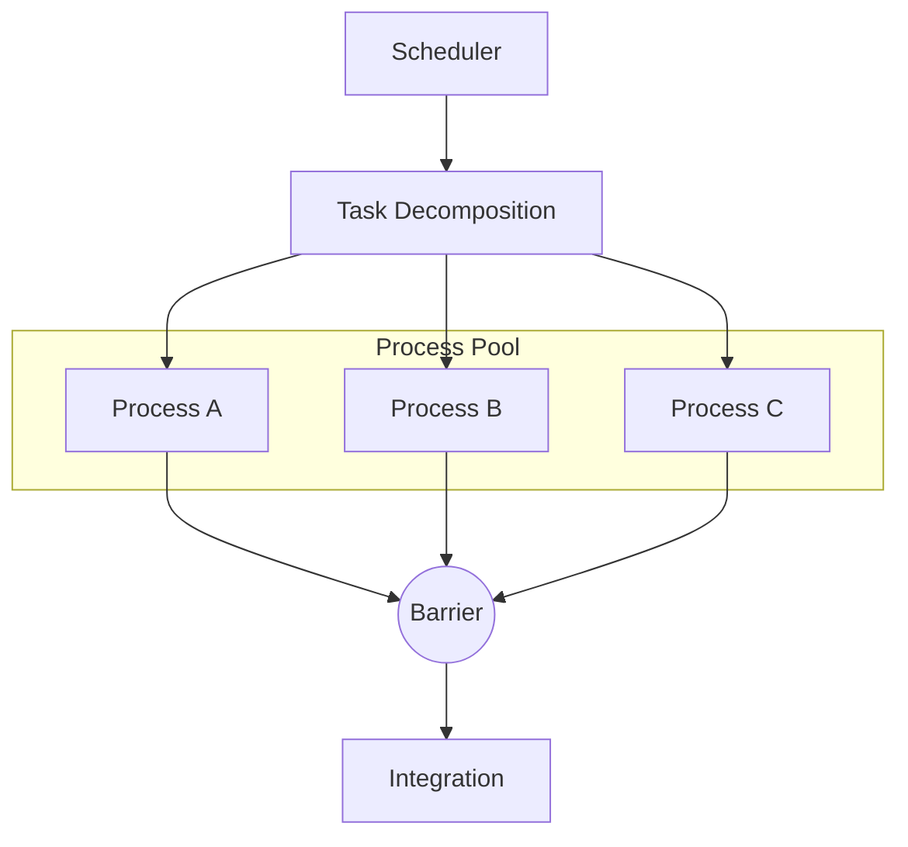
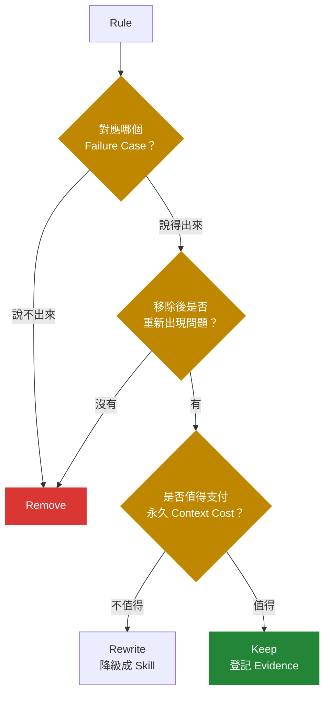

<div align="center">


# Serendipity — Epiphany

**Turn development experience into reusable workflows.**

把開發過程中的經驗，沉澱成可重複使用的工作流。

</div>

---

## 這套配置在解什麼問題

大部分的開發配置著重於「如何完成當前任務」。

這套配置另外處理一個長期問題：**如何把開發過程中反覆出現的問題、決策與驗證結果，沉澱成可重複使用的工程規則。**



`docs/lessons/` 保存案例與決策背景，`.claude/rules/` 保存已經值得常駐的工程規則，而 `ABLATION.md` 負責記錄這些規則存在的失敗證據與移除條件。

目標不是累積筆記，而是建立一條：

**Experience → Evidence → Rule → Workflow**

的升級路徑。

---

## 快速開始

```bash
# 1. 複製到新專案
cp -r "Serendipity — Epiphany/.claude" your-project/.claude
cp -r "Serendipity — Epiphany/templates" your-project/templates

# 2. 執行新專案 bootstrap
#    templates/_meta/new_project_bootstrap.md
```

Windows：

```powershell
Copy-Item ".\Serendipity — Epiphany\.claude" -Destination "your-project\.claude" -Recurse
Copy-Item ".\Serendipity — Epiphany\templates" -Destination "your-project\templates" -Recurse
```

完整安裝方式、四種執行路徑與各能力的觸發條件：

**[docs/USAGE.md](docs/USAGE.md)**

---

## 結構

```text
CLAUDE.md                  # 常駐入口：系統定位、啟動方式、預設執行節奏
.claude/
├── CLAUDE.md              # 元件責任與 8 條維護契約
├── EXECUTION_MODEL.md     # 任務分解、執行派發與平行協調的完整定義
├── WORKFLOW.md            # 執行層級、角色分工、Context 邊界與驗證流程
├── ROLE_MODEL.md          # 十個 SDLC 角色、四個抽象層、三道翻譯 Gate
├── RUNBOOK.md             # 四種執行路徑（A 直接執行／B 規劃／C 探索／D 蒐證）
├── ABLATION.md            # 常駐規則消融紀錄與失敗證據
├── rules/           (6)   # 常駐工程規則
├── skills/         (17)   # Coroutine 能力庫，按需載入
├── agents/         (14)   # Thread / Process 執行模板
└── settings.json          # 最小權限基線＋敏感路徑 deny
templates/                 # CONTEXT / ADR / PROCESS_SPEC / HANDOFF ＋ bootstrap
docs/
├── USAGE.md               # 詳細使用說明
├── DESIGN_RATIONALE.md    # 設計決策、取捨與非目標
└── lessons/               # 經驗、事件與決策紀錄
```

---

## 執行模型：任務分解、執行派發、平行協調

任務的**分解、派發、同步與資源控制**統一使用作業系統與併發模型的既有語彙。

目的不是模擬作業系統，而是直接借用成熟的 concurrency mental model，處理 Agent 開發中相同類型的問題：

* 執行隔離
* 平行工作
* 寫入衝突
* 資源競爭
* 相依關係
* 同步點
* Context 邊界

### 分解階層

執行單元只有三層，沒有第四種：



一個 Process 必須同時滿足四條：**完整**（端到端可觀察）· **可獨立驗證** · **裝得進一個新 Process** · **接縫已定**。

裝不進就往下拆，無法獨立驗證就往上合併。

| 執行單位 | 隔離程度 | 使用情境 |
| --- | --- | --- |
| **Coroutine** | 無，同一 Context | 只需要一套方法或能力，不需要隔離。**預設執行單位** |
| **Thread** | 獨立 Context，共享工作樹 | 唯讀 fan-out、搜尋、審查、第二意見 |
| **Process** | 完整隔離 | 獨立工作單元、垂直切片、規劃 → 實作邊界 |
| **Connection** | 外部資源 | CLI、MCP、瀏覽器、DB、API quota、GPU |

### Pool

提供三種資源池：

* **Thread Pool**：唯讀 fan-out
* **Process Pool**：多個獨立 Process
* **Connection Pool**：受限外部資源，可回收且不可洩漏

### Synchronization

使用既有同步原語描述執行約束：

`Ready Queue` · `Mutex` · `Semaphore` · `Critical Section` · `Barrier` · `Fork/Join` · `Race Condition` · `Deadlock` · `Starvation`

另外定義：

**`GIL` = Human Decision Lock**

當流程需要使用者做決策時，一次只提出一個需要阻塞流程的決策問題。

### 元件對應

| 配置元件 | 執行模型 |
| --- | --- |
| `rules/` | Kernel |
| `skills/` | Coroutine Library |
| `agents/` | Thread / Process Templates |
| `HANDOFF` | IPC Message |
| `CONTEXT.md` | Shared Memory |
| Context Window | Working Memory |
| Compact | Swap |

其中最重要的一個區分是：

**寫入衝突屬於 Mutual Exclusion，不等於 Dependency。**



如果兩個工作只是不能同時修改同一區域，應使用 `Mutex / Critical Section` 描述，而不是標成 `Depends on`。

否則會產生不存在的 Dependency，進而製造假的 Critical Path。

完整定義：

[.claude/EXECUTION_MODEL.md](.claude/EXECUTION_MODEL.md)

---

## 三個執行角色

| 角色 | 執行位置 | 責任 | 不負責 |
| --- | --- | --- | --- |
| **Scheduler** | 主 Process | 任務分解、執行派發、同步、驗證、結果整合 | 不執行 Worker 級實作 |
| **Supervisor** | 高能力唯讀 Thread | 在關鍵 Decision Boundary 提供分析與第二意見 | **不直接修改工作樹** |
| **Worker** | Thread / Process Pool | 執行被派發的 Process | 不自行核准結果、不自行取得下一個 Process |

核心原則：

**Model 是可替換的執行資源；Execution Role 才是穩定的系統介面。**

---

## 十個 SDLC 角色

執行角色管**怎麼跑**；SDLC 角色管**負責哪一層的正確性**。兩者正交。



**三個翻譯邊界就是三道 Gate。** 跳過任何一道，下游會拿到一份自己補完的假需求。

| 角色 | 負責哪一層的正確性 | 執行單位 |
| --- | --- | --- |
| **PM** | 商業價值：為什麼要做 | Scheduler ＋ `se-clarify` / `se-feasibility` |
| **UX / UI** | 使用者行為與視覺呈現 | `thread-ux` |
| **SA** | 業務規則：系統怎麼判斷 | `thread-sa` |
| **Architect** | 系統演進：怎麼活下去 | `thread-system-architect` |
| **SD** | 開發落地：模組怎麼長 | Scheduler ＋ `se-design` |
| **DBA** | 資料正確性：資料怎麼存 | `thread-dba` |
| **Dev** | 實作正確性 | `process-worker` |
| **QA** | 結果正確性 | `thread-reviewer-spec` ＋ `-standards` |
| **DevOps / SRE** | 上線運行：活著 | `thread-devops` |

UX、SA、DBA、DevOps 的分析**寫入範圍不相交**，是同一個 Thread Pool；**Architect 必須在 Barrier 之後**——它要看齊四份分析才能取捨。

### AI 只改變了最下游兩層

Dev 與 QA 被大幅改變；**其餘八層幾乎沒變，因為那些是「定義問題」與「控制複雜度」的工作。**

實務結論不是上游變輕鬆，而是相反：Dev 層變便宜 → 瓶頸移到「有沒有定義清楚」；生成量變大 → 驗證成本上升；**上游一錯，下游高速產出錯的東西。**

**這不是 AI 取代下游，是上游的錯誤被放大得更快。** 三道翻譯 Gate 的價值因此變高。

完整定義：[.claude/ROLE_MODEL.md](.claude/ROLE_MODEL.md)

---

## 常駐規則（6 條）

| 規則 | 核心 |
| --- | --- |
| **core-rules** | 來源優先、可追溯、保護使用者工作、以證據宣告完成、最小變更、保存可重用經驗 |
| **evidence-grades** | 每個結論帶證據等級：`已確認`／`推論`／`候選`／`未知`／`未驗證` |
| **dispatch** | 預設 Coroutine、獨立切片使用 Process、平行執行前確認寫入衝突與同步需求 |
| **git-workflow** | 分支隔離、Critical Section 前建立 backup tag、commit → push → PR 保持連續 |
| **thinking-boundary** | 區分快速執行與深度分析；原型階段避免過早治理；資源超支必須顯式回報 |
| **register** | 文件 L1／L2／L3 分級，以及對話何時升級到 Decision Layer |

新增常駐規則前，先檢查：

[.claude/ABLATION.md](.claude/ABLATION.md)

**無法指出具體 Failure Case、Evidence 或 Prevention Value 的規則，不應進入常駐層。**

---

## Skills（17 個 Coroutine）

### 通用能力

| 執行情境 | 載入 |
| --- | --- |
| 需求仍模糊，需要探索問題空間與系統邊界 | `se-design` |
| 問題空間過大，需要定位下一個可回答問題 | `se-discovery` |
| 需要壓力測試假設、找出缺漏或取得外部決策 | `se-clarify` |
| 需要先判斷技術或產品可行性 | `se-feasibility` |
| 專案術語、Domain Language 或命名不一致 | `se-context-language` |
| 進入程式實作 | `se-minimal-change` |
| Debug、定位 Root Cause | `se-debug` |
| 變更完成，需要 Spec / Standards 雙軸審查 | `se-two-axis-review` |
| **要做任務分解、執行派發與平行協調** | **`se-scheduling`** |
| **從零啟動專案、盤點缺哪個角色的產出** | **`se-sdlc`** |
| 外部工具、MCP、CLI 或環境能力不確定 | `se-preflight` |
| 建立分支、完成變更並準備 PR | `se-branch-lifecycle` |
| 輸出需要聚焦、壓縮或重新組織 | `se-focus` |
| 本輪產生值得保留的工程經驗 | `se-epiphany` |
| 新增或修改 Skill | `se-skill-authoring` |

### 領域能力

| 執行情境 | 載入 |
| --- | --- |
| 系統設計、PRD → Architecture、容量估算、瓶頸與 Trade-off 分析 | **`se-system-design`** |
| ML 專案、資料切分、Leakage、Pipeline、Evaluation、**Interpretability**、Deployment | **`se-ml-lifecycle`** |

完整路由與選擇條件：

[.claude/skills/INDEX.md](.claude/skills/INDEX.md)

---

## Agents（14 個執行模板）

Agent 名稱直接表示：

**Execution Unit + Responsibility**

| Agent | 型別 | 使用情境 |
| --- | --- | --- |
| `thread-scout` | Thread | 廣度搜尋與資訊蒐集，只回傳結論與證據 |
| `thread-supervisor` | Thread（高能力模型） | 結果矛盾、驗證連續失敗、計畫需要結構性調整 |
| `thread-reviewer-spec` | Thread | Spec Review：確認是否實作正確需求 |
| `thread-reviewer-standards` | Thread | Standards Review：確認實作品質與工程規範 |
| `thread-security` | Thread | Authentication、Input、Secret、External Interface、Deployment Security |
| `process-worker` | Process | 一個 **Process** 的完整實作與驗證 |
| **`thread-system-architect`** | **Thread（高能力模型）** | **系統設計：估算 → 瓶頸 → 深入分析 → Trade-off** |
| **`process-ml-engineer`** | **Process** | **ML Lifecycle：定義 → Split → Pipeline → Evaluation → Deployment** |
| **`thread-ml-auditor`** | **Thread（高能力模型）** | **既有 ML Pipeline 與 Evaluation Validity 稽核** |
| **`thread-ml-interpreter`** | **Thread（高能力模型）** | **模型可解釋性：Global / Local、Stability、Failure Mode、Counterfactual** |
| `thread-ux` | Thread | UX / UI：使用流程、關鍵路徑、失敗與空狀態、介面一致性 |
| `thread-sa` | Thread | SA：業務規則表、判定條件、例外與邊界、不變量 |
| `thread-dba` | Thread | DBA：Row grain、不變量保護、索引對齊、遷移安全 |
| `thread-devops` | Thread | DevOps / SRE：部署、可觀測性、回滾、韌性 |

---

## Execution Flow

典型的多 Agent 執行流程：



當任務可以平行化時：



當工作需要完整隔離時：



---

## 十條設計原則

1. **Evidence is a first-class citizen.**
   不把推論寫成事實；所有重要結論都應能追溯其證據狀態。

2. **Deterministic Engineering × Agent.**
   可以由程式、型別、測試或檢查清單保證的事情，不交給模型自由判斷。

3. **Permanent Rules Require Failure Evidence.**
   常駐規則必須能對應實際 Failure Case，否則只是額外 Context Cost。

4. **Use the Lowest Sufficient Execution Cost.**
   能用 Coroutine 解決就不建立 Process；需要隔離時才提高執行成本。

5. **A Finding Is a Claim, Not a Command.**
   Finding 必須可以被驗證、反證與重新分級。

6. **Spec Review and Standards Review Stay Separate.**
   「做錯東西」與「東西做得不好」是兩種不同 Failure Mode。

7. **Shared Language Before Shared Code.**
   先統一 Domain Language，再讓多個 Agent 同時修改系統。

8. **Reuse Existing Engineering Vocabulary.**
   優先使用 Process、Thread、Mutex、Barrier、Queue 等既有工程語彙，而不是建立新的抽象名稱。

9. **Human Decisions Are Serialized.**
   需要人的決策屬於共享稀缺資源，應避免同時提出多個阻塞問題。

10. **Reusable Experience Must Have an Upgrade Path.**
    一次性的經驗先保存為 Lesson；只有通過實戰與證據驗證後，才升級為常駐 Rule。

每條原則背後的設計推導、Trade-off 與 Non-goals：

[docs/DESIGN_RATIONALE.md](docs/DESIGN_RATIONALE.md)

---

## 首次使用後

完成第一輪實際專案後，執行一次：

**Rule Ablation Review**

目前常駐面共 339 行，其中有四條仍標記為「未登記」，代表尚未建立足夠的 Failure Evidence。

這些項目應優先接受消融檢查：



流程：

[.claude/ABLATION.md](.claude/ABLATION.md)

範例：

[docs/lessons/0001](docs/lessons/0001-ablation-first-run.md)

`RUNBOOK` 與 `ABLATION` 都不是固定規格，而是會隨實際執行結果持續修正的工程文件。

每次修改都應留下對應的 Evidence 或 Lesson。

---

## License

MIT
